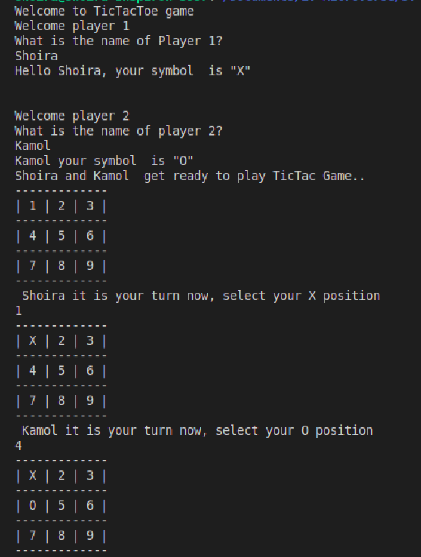

# RUBY PROJECT 3: TIC TAC TOE
This is a Tic Tac Toe game built on Ruby. The main goal of this project is to put into practice the main concepts of Object Oriented Programming. Particularly, classes and access to their attributes. 

## Definition of tic-tac-toe (Merriam Webster)
: a game in which two players alternately put Xs and Os in compartments of a figure formed by two vertical lines crossing two horizontal lines and each tries to get a row of three Xs or three Os before the opponent does

## Built With

- Ruby

## GAME INSTRUCTIONS

* Tic Tac Toe is board game played on a board with a 3 squared by 3 squared grid.
* The players are assigned their own symbols to place on the board cells
* Player 1 will be assigned the `X` symbol.
* Player 2 will be assigned the `O` symbol.
* Players take turn to place their symbols on the board.
* The grid is numbered from 1 to 9.
* You place the symbol by choosing the cell number.
* The  First Player to get 3 of her symbols in a row (up, down, across, or diagonally) wins the game.
* When all 9 squares are full, the game is over. If no player has 3 marks in a row, the game ends in a tie.

## Getting Started
To get a local copy up and running follow these simple example steps.
Clone repository from github to your local drive by following these steps:
- Go to the main page of the repository
- Above the listed files, click the green Code button
- You can clone the repository using:
  - SSH: `https://github.com/ShoiraTa/TicTacToe.git`.
- Open Terminal
- Change the current working directory to the location you want the cloned directory
- Type one of the git clone commands listed above.
- Press Enter to create your local clone

### Prerequisites
- Text editor
- GitHub
- Git
- Ruby

## Authors

👤 **Shoira Toshpulatova**

- GitHub: [@githubhandle](https://github.com/shoirata)
- LinkedIn: [LinkedIn](https://www.linkedin.com/in/shoira-tashpulatova-bab4a7122/)

## Acknowledgments

- Microverse
- The Odin Project

## 📝 License

This project is [MIT](./LICENSE) licensed.